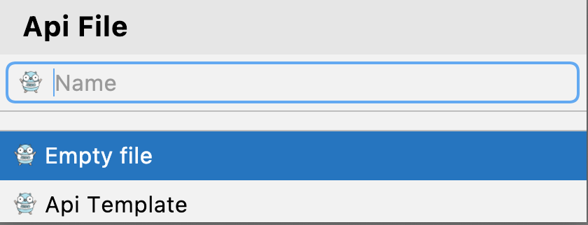
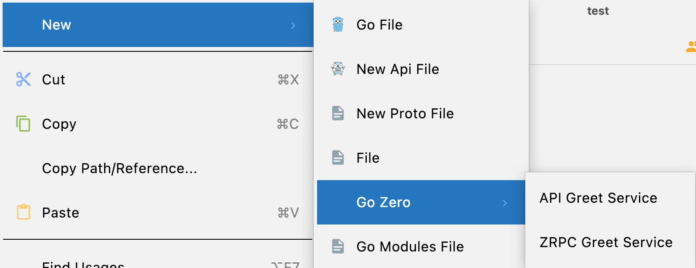
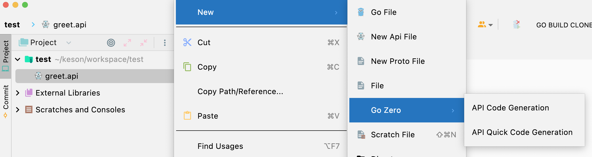
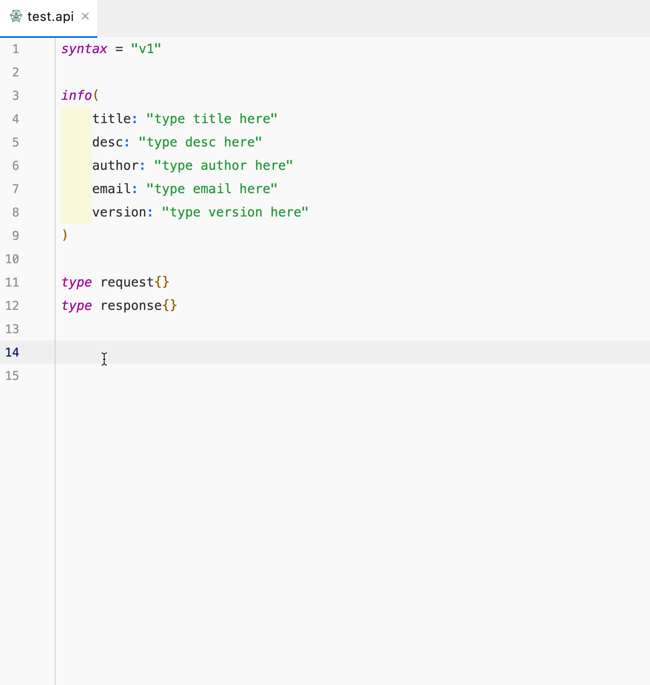

# goctl intellij  Plugin

[](https://github.com/tal-tech/go-zero)
[](https://github.com/zeromicro/goctl-intellij/blob/main/LICENSE)
[](https://github.com/zeromicro/goctl-intellij/releases)

# Introduction
A plugin tool that supports go-zero api language structure syntax highlighting, detection, and api, rpc, and model shortcut generation.


# idea version requirements

No less than 193.0 (2019.3)

# Version features

* api syntax highlighting
* api syntax, semantic detection
* struct, route, handler duplicate definition detection
* type jump to type declaration location
* context menu support api, rpc, mode related menu options
* Code formatting (option+command+L)
* Code hinting

# Installation methods

## Way 1
Find the latest zip package in the github release, download and install it locally. (No need to decompress)

## Way 2
In the plugin store, just search for `Goctl` and install it (currently the adopted version in the store is relatively low.)


## Preview


# New Api file

In the project area target folder ` Right click -> New -> New Api File -> Empty File/Api Template`, as shown in the figure.




# New Proto File
In the project area target folder `Right click -> New -> New Proto File -> Empty File/Proto Template`, as shown in the figure.


# Quickly generate api/rpc service
In the target folder ` Right click -> New -> Go Zero -> Api Greet Service/Rpc Greet Service`



# Api code generation
## 1. api file right click to generate


## 2. api file edit area right-click generation


## Api code generation instructions
The difference between `API Code Generation` and `API Quick Code Generation` is that
- `API Code Generation` in `goctl` uses the specified values for the relevant command parameters, and its code generation instructions read as follows
    ```shell
    $ goctl api go --api=${API file path} --style=gozero --home="~/.goctl" --dir=${API file folder}
    ```
- `API Quick Code Generation` will open a popup for the user to fill in `--style`, `-- dir`, `--home`, etc.
  

# zRPC code generation
## 1. proto file right click generation


## 2. proto file edit area right-click generation


## zRPC Code Generation Instructions
The difference between `ZRPC Code Generation` and `ZRPC Quick Code Generation` is that
- `ZRPC Code Generation` uses the specified values for the relevant command parameters of `goctl`, and its code generation instructions read as follows
    ```shell
    $ goctl rpc protoc ${proto file path} --style=gozero --home="~/.goctl" --go_out=${API file folder} --grpc-go_out=${API file folder} --zrpc_out=${API file folder }
    ```
- `ZRPC Quick Code Generation` will open a popup window for users to fill in `--style`, `-- dir`, `--home`, `proto_path` (if there are other proto files imported), etc.
    - No import case
      
    - With import, proto_path currently only supports but file selection, so **importing proto from a different folder is not supported**.
      

# Model code generation
## 1. sql file right click generation


## 2. sql file edit area right-click generation


## Model code generation instructions
**Model code generation is cached by default. **

The difference between `Model Code Generation` and `Model Quick Code Generation` is that
- `Model Code Generation` uses the specified values for the `goctl` command parameters, and the code generation commands are as follows
    ```shell
    $ goctl model mysql ddl --src=${sql file path} --dir=${sql file folder} --style=gozero -c --home="~/.goctl"
    ```
- `Model Quick Code Generation` will open a popup for the user to fill in `--style`, `-- dir`, `--home`, `--cache`, etc.
  
-
# Error message


# Live Template
Live Template can speed up the writing of api files, for example, if we type `main` keyword in a go file and enter it according to tip, a template code will be inserted
```golang
func main(){

}
```
Or maybe you'll be more familiar with the following image, where you defined the template once upon a time


Let's get into the template usage instructions in today's api syntax, and let's see the effect of the service template


#### Preset templates and effective areas
| Template keywords | psiTree effect area | description
| ---- | ---- | ---- | 
| @doc | ApiService |doc annotation template |
| doc | ApiService |doc annotation template|
| struct |struct |struct declaration template|
| info | ApiFile |info block template|
| type | ApiFile |type group template|
| handler | ApiService |handler filename template|
| get | ApiService |get method routing template|
| head | ApiService |head method routing template|
| post | ApiService |post method routing template|
| put | ApiService |put method routing template|
| delete | ApiService |delete method routing template|
| connect | ApiService |connect method routing template|
| options | ApiService |options method routing template|
| trace | ApiService |trace method routing template|
| service | ApiFile |service service block template|
| json | Tag|Tag literal |tag template|
| xml | Tag|Tag literal |tag template|
| path | Tag|Tag literal |tag template|
| form | Tag|Tag literal |tag template|

About each template corresponding content can be seen in `Goland(mac Os)->Preference->Editor->Live Templates-> Api|Api Tags` in the detailed template content, such as json tag template content for