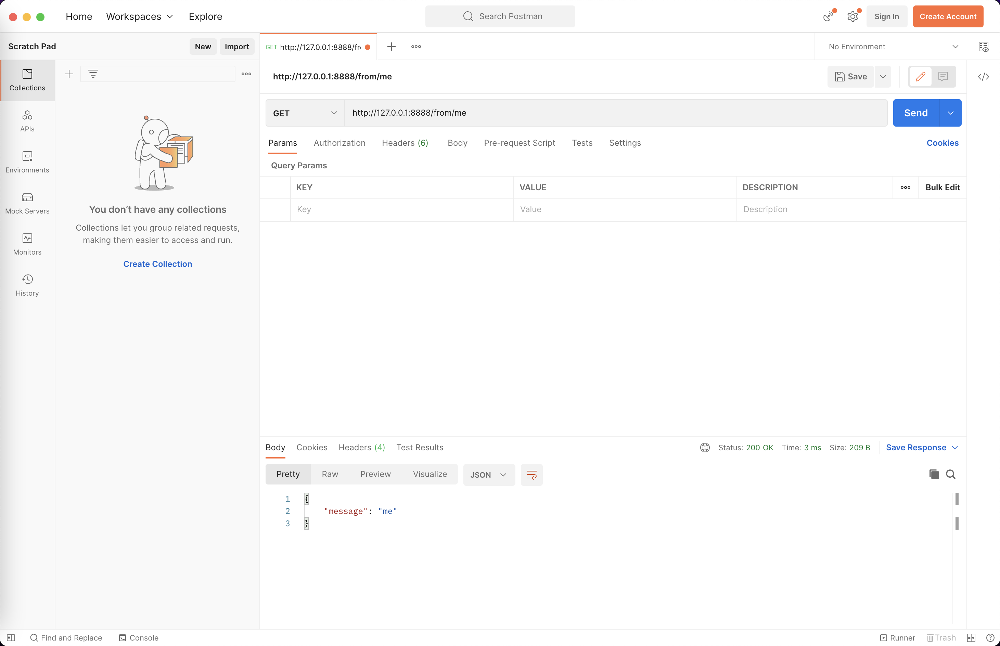

import Tabs from '@theme/Tabs';
import TabItem from '@theme/TabItem';

## 概述

在完成了 <a href="/docs/tasks/installation/goctl" target="_blank">goctl 安装</a> 后，我们可以通过 goctl 创建一个最小化的
HTTP 服务来了解 goctl 的 go-zero api 服务的概况。

## 任务目标

1. 学会如何使用 goctl 创建一个最小化的 HTTP 服务
1. 初步了解 go-zero 的项目结构


## 准备条件

1. <a href="/docs/tasks" target="_blank">完成 golang 安装</a> 
1. <a href="/docs/tasks/installation/goctl" target="_blank">完成 goctl 安装</a> 

## 代码生成

```shell
# 创建工作空间并进入该目录
$ mkdir -p ~/workspace/api && cd ~/workspace/api
# 执行指令生成 demo 服务
$ goctl api new demo
Done.
```
执行完指令后，会在当前目录下生成一个 demo 目录，该目录下包含了一个最小化的 HTTP 服务，我们来查看一下该服务的目录结构。

```shell
# 进入 demo 服务目录
$ cd ~/workspace/api/demo
# 查看文件列表
$ ls
demo.api demo.go  etc      go.mod   internal
# 查看目录接口
$ tree
.
├── demo.api
├── demo.go
├── etc
│   └── demo-api.yaml
├── go.mod
└── internal
    ├── config
    │   └── config.go
    ├── handler
    │   ├── demohandler.go
    │   └── routes.go
    ├── logic
    │   └── demologic.go
    ├── svc
    │   └── servicecontext.go
    └── types
        └── types.go
```

:::note 注意
 API、RPC、Job 服务目录结构大同小异，go-zero 项目结构详情可参阅 <a href="/docs/concepts/layout">《项目结构》</a>
:::

## 编写简单的逻辑代码

在完成上述代码生成后，我们可以找到 `~/workspace/api/demo/internal/logic/demologic.go` 文件，编辑该文件，在 `27` 至 `28`  行添加如下代码：

```go
resp = new(types.Response)
resp.Message = req.Name
```

## 启动服务

在完成上述代码编写后，我们可以通过如下指令启动服务：

```shell
# 进入服务目录
$ cd ~/workspace/api/demo
# 整理依赖文件
$ go mod tidy
# 启动 go 程序
$ go run demo.go
```

当你看到有如下输出 `Starting server at 0.0.0.0:8888...`，说明服务已经启动成功,接着我们来访问一下该 HTTP 服务。

<Tabs>
<TabItem value="terminal" label="终端中访问" default>

```bash
$ curl --request GET 'http://127.0.0.1:8888/from/me'
```

当你在终端看到输出内容 `{"message":"me"}` 时代表你的服务已经成功启动。

</TabItem>

<TabItem value="postman" label="Postman 中访问" default>



<center> 在 Postman 中访问 </center>

当你在 Postman 中看到如下输出内容时，代表你的服务已经成功启动。

```json
{
    "message": "me"
}
```
</TabItem>
</Tabs>


当你按照文档步骤走到这里，恭喜你 🎉 🎉 🎉 ，你已经完成了最简单的 go-zero api 服务的创建和启动了，如需了解 `goctl` 工具的使用说明请参阅 <a href="/docs/tutorials/cli/overview" target="_blank">《CLI 工具》</a>，如需了解完整 go-zero api 服务的使用说明请参阅 <a href="/docs/tutorials/http/server/configuration/service" target="_blank">《HTTP Server》</a>。