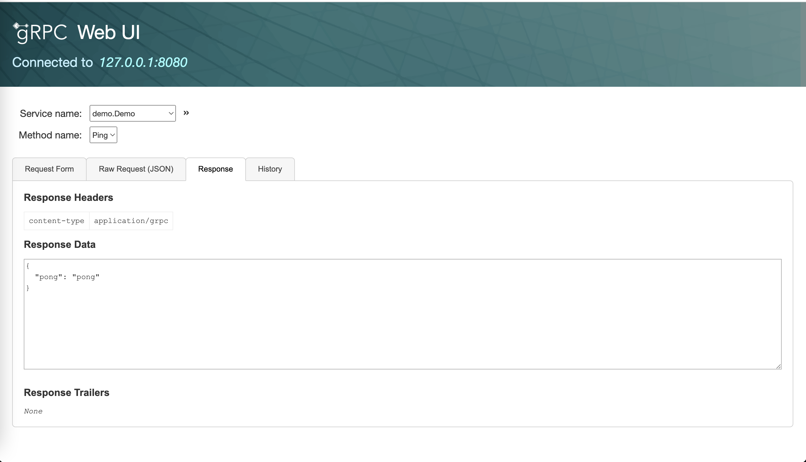
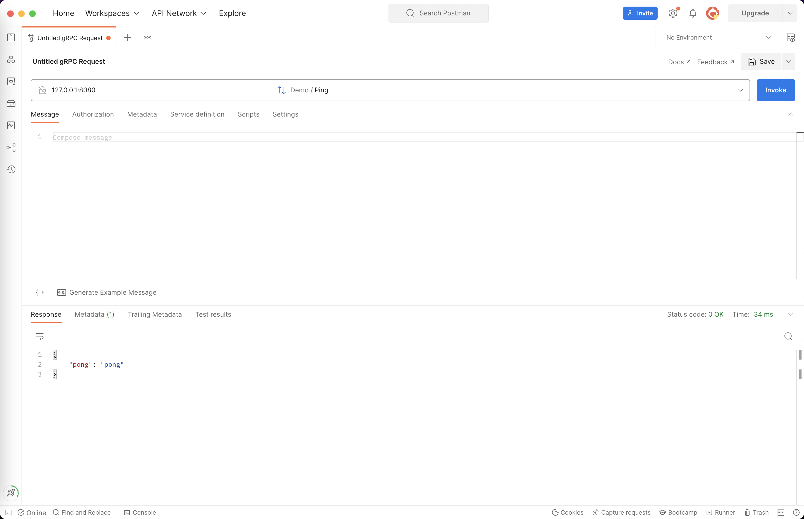

import Tabs from '@theme/Tabs';
import TabItem from '@theme/TabItem';

## 概述

在完成了 <a href="/docs/tasks/installation/goctl" target="_blank">goctl 安装</a> 后，我们可以通过 goctl 创建一个最小化的
gRPC 服务来了解 goctl 的 go-zero  gRPC 服务的概况。

## 任务目标

1. 学会如何使用 goctl 创建一个最小化的 gRPC 服务
1. 初步了解 go-zero 的项目结构
1. 初步掌握 gRPC 本地调试的方法


## 准备条件

1. <a href="/docs/tasks" target="_blank">完成 golang 安装</a> 
1. <a href="/docs/tasks/installation/goctl" target="_blank">完成 goctl 安装</a> 

## 代码生成

```shell
# 创建工作空间并进入该目录
$ mkdir -p ~/workspace/rpc && cd ~/workspace/rpc
# 执行指令生成 demo 服务
$ goctl rpc new demo
Done.
```
执行完指令后，会在当前目录下生成一个 demo 目录，该目录下包含了一个最小化的 gRPC 服务，我们来查看一下该服务的目录结构。

```shell
# 进入 demo 服务目录
$ cd ~/workspace/rpc/demo
# 查看文件列表
$ ls
demo       demo.go    demo.proto democlient etc        go.mod     internal
# 查看目录接口
$ tree
.
├── demo
│   ├── demo.pb.go
│   └── demo_grpc.pb.go
├── demo.go
├── demo.proto
├── democlient
│   └── demo.go
├── etc
│   └── demo.yaml
├── go.mod
└── internal
    ├── config
    │   └── config.go
    ├── logic
    │   └── pinglogic.go
    ├── server
    │   └── demoserver.go
    └── svc
        └── servicecontext.go
```

:::note 注意
 API、RPC、Job 服务目录结构大同小异，go-zero 项目结构详情可参阅 <a href="/docs/concepts/layout">《项目结构》</a>
:::

## 编写简单的逻辑代码

在完成上述代码生成后，我们可以找到 `~/workspace/rpc/demo/internal/logic/demologic.go` 文件，编辑该文件，将 `29` 行替换为如下代码：

```go
return &demo.Response{
    Pong:"pong",
}, nil
```

然后把你一下配置文件 `~/workspace/rpc/demo/etc/demo.yaml`，删除 `3` 至 `7` 行内容，然后在追加内容 `Mode: dev` 至末尾，使配置文件内容为：

```yaml
Name: demo.rpc
ListenOn: 0.0.0.0:8080
Mode: dev

```

:::note 注意
goctl 生成最小化 gRPC 服务默认启动会向 ETCD 注册中心注册当前服务的信息，本次演示就不需要注册中心，所以删除了配置文件中的注册中心配置。
:::

## 启动服务

在完成上述代码编写后，我们可以通过如下指令启动服务：

```shell
# 进入服务目录
$ cd ~/workspace/rpc/demo
# 整理依赖文件
$ go mod tidy
# 启动 go 程序
$ go run demo.go
```

当你看到有如下输出 `Starting rpc server at 0.0.0.0:8080...`，说明服务已经启动成功,接着我们来访问一下该 gRPC 服务。

<Tabs>
<TabItem value="grpcurl" label="grpcurl 访问" default>

```bash
$ grpcurl -plaintext 127.0.0.1:8080 demo.Demo/Ping
```

当你在终端看到如下输出内容时代表你的服务已经成功启动。

```json
{
  "pong": "pong"
}
```

:::note 注意
grpcurl 是一个命令行工具，用于访问 gRPC 服务，详情可参阅 <a href="https://github.com/fullstorydev/grpcurl">《grpcurl》</a>
:::

</TabItem>

<TabItem value="grpcui" label="grpcui 访问" default>

首先在终端启动 grpcui 服务：

```bash
$ grpcui -plaintext 127.0.0.1:8080
```

 然后在浏览器中访问 `Ping` 接口，当你看到如下输出内容时代表你的服务已经成功启动。

 ```json
 {
  "pong": "pong"
}
 ```

 

<center> grpcui 中访问 </center>

:::note 注意
grpcui 是一个gRPC UI 调试工具，用于访问 gRPC 服务，详情可参阅 <a href="https://github.com/fullstorydev/grpcui">《grpcui》</a>
:::

</TabItem>

<TabItem value="postman" label="Postman 中访问" default>



<center> 在 Postman 中访问 </center>

当你在 Postman 中看到如下输出内容时，代表你的服务已经成功启动。

```json
{
    "message": "me"
}
```
</TabItem>

</Tabs>


当你按照文档步骤走到这里，恭喜你 🎉 🎉 🎉 ，你已经完成了最简单的 go-zero gRPC 服务的创建和启动了，如需了解 `goctl` 工具的使用说明请参阅 <a href="/docs/tutorials/cli/overview" target="_blank">《CLI 工具》</a>，如需了解完整 go-zero gRPC Server 服务的使用说明请参阅 <a href="/docs/tutorials/grpc/server/configuration/service" target="_blank">gRPC Server》</a>。