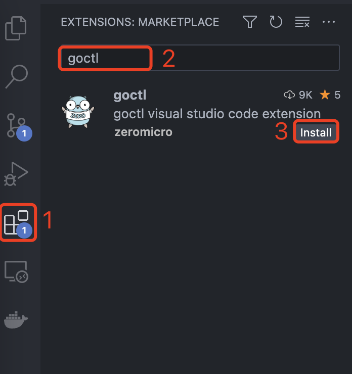

## 概述

`goctl` vscode 编辑器插件可以安装在 `1.46.0+` 版本的 `Visual Studio Code` 上，首先请确保你的 `Visual Studio Code` 版本符合要求，并已安装 `goctl` 命令行工具。如果尚未安装 `Visual Studio Code`，请安装并打开 `Visual Studio Code`。 

## 特性

- api 文件语法高亮
- 跳转到定义/引用
- 代码格式化
- 代码块提示

## 安装

打开 `Visual Studio Code` | `Extensions`，搜索 `goctl`，点击 `install` 安装。

