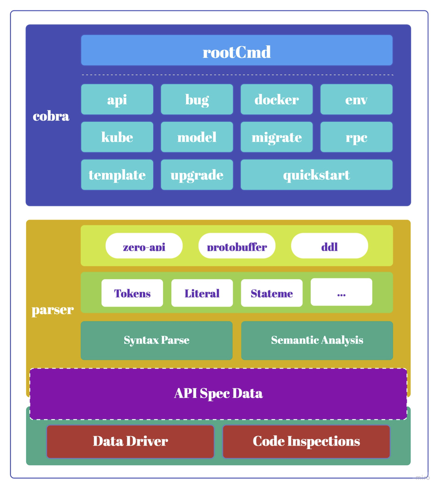
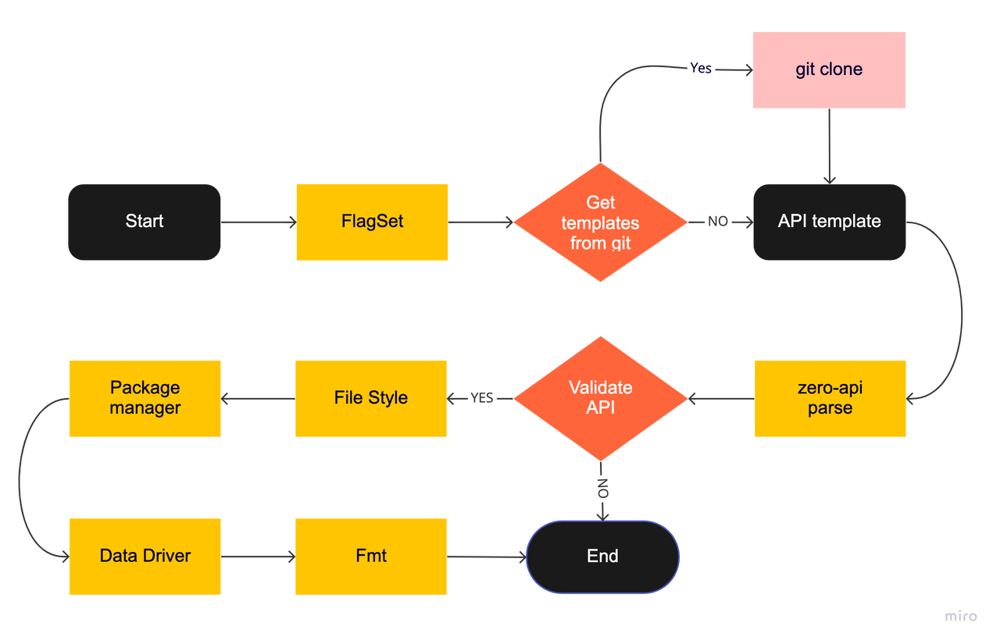
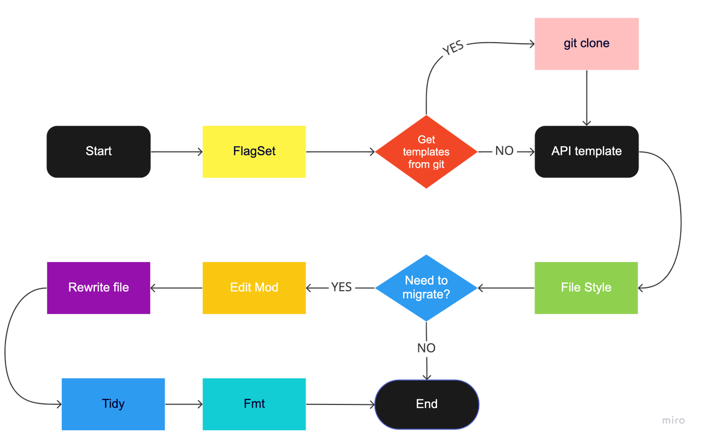
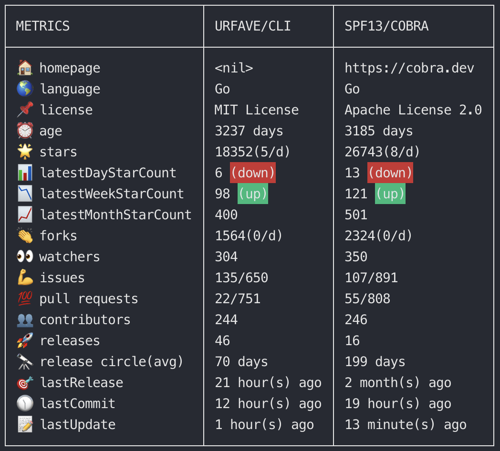
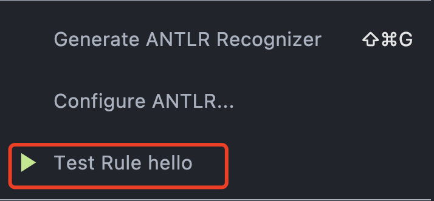

# goctl 效能工具深度解析（二）

[《 goctl 效能工具深度解析（一）》](goctl-share-part-one)

## 四 goctl 源码解读

**结构图**



### goctl api

**流程图**


### goctl rpc

**流程图**


### goctl model

**流程图**


### goctl model

**流程图**


## 五、脚手架开发流程

脚手架在我们的开发过程中可以帮助我们做很多事情，比如依赖安装、代码生成、服务部署文件生成等,如果我们要实现一个类似 goctl 的脚手架需要做哪些准备工作或者技能储备呢？

:::tip "知识点储备"

1. Golang 模板
2. 正则表达式
3. BNF 范式
4. ANTLR
:::


### 1. 工具选择(CLI)

urfave/cli 与 cobra 对比(以下数据截止时间为2022年5月25日 18点00分)

```bash
$ github-compare urfave/cli spf13/cobra
```



|                                urfave/cli |                  | spf13/cobra                                                         |
|------------------------------------------:|------------------|:--------------------------------------------------------------------|
|  aws、kubernetes、go-micro、github、microsoft | 知名用户（择自 Uesd by） | etcd、GoogleCloud、kubernetes、apache、zeromicro、tidb、Github CLI、Hugo   | 
|                              贴紧 golang 原生 | 特点               | POSIX 标准（贴合 UNIX 设计），支持全局 flag                                      |                                                                   |

从以上各对比指标来看，cobra 是我更倾向的选择。

### 2. 定义FlagSet (Command)

根据自己需要实现的功能添加子指令和 flag。

### 3. 领域特定语言选择（DSL, optional）

领域特定语言的选择，像 goctl 中的 api 和 rpc 功能一样，如果你的脚手架需要选择一套 DSL，那么 DSL 的选择也是必须要考虑的，自研还是选择成熟的 DSL，这都是要总和考虑的。

#### 3.1 自研 DSL
1. 调研主流语言的 DSL 规范，如 Golang、yaml
2. 编写 DSL 规范（Spec），了解 BNF、ABNF、EBNF
3. 选择合适的语法解析器，这里我们不需要对编译原理有足够的知识，我们的 DSL 不是编程级别的，不用考虑太多，因此目前市面上一些常见的解析器就可以满足，我们只需要阅读其文档做一些了解即可上手实现简单的 DSL 解析，下文我将贴一些目前存在的一些解析器或者案例参考：

| 工具名称          | 实现语法   | 优点                              | 不足                               |
|---------------|--------|---------------------------------|----------------------------------|
| Golang Parser | Golang | 兼容、易维护、内存使用较低、贴近 golang         | 上手成本高，自己从0实现词法分析，语法解析到 AST 的所有过程 |
| ANTLR（g4）     | Java   | 上手门槛低、Intellij提供了代码生成插件、完整的文档介绍 | 内存要求高，有些系统架构支持不友好，如386           |
| YACC          | C      | -                               | 暂不支持 golang                      |

##### 3.1.1 ANTLR 使用示例

:::tip "功能目标"
- 实现多行普通的 Hello ${msg} 语法
- 支持单行注释
  技能要点
- 正则表达式
- ANTLR 使用
:::

```bash
// 这是一个简单的 DSL 描述文件
Hello World
Hello gozero
Hello keson
```

**3.1.1.1 环境准备**
- Java
- Intellij、Goland
- 插件安装：ANTLR v4、Grammar-Kit

**3.1.1.2 编写语法文件 Hello.g4**

```g4
grammar Hello;

hello: spec*;
spec: ID ID;

ID:         Letter*;
WS: [ \t\r\n\u000C]+ -> channel(HIDDEN);
LINE_COMMENT:   '//' ~[\r\n]* -> channel(HIDDEN);

ERRCHAR
   :  .  -> channel(HIDDEN)
   ;
   
fragment Letter
    : [a-zA-Z$_] // these are the "java letters" below 0x7F
    | ~[\u0000-\u007F\uD800-\uDBFF] // covers all characters above 0x7F which are not a surrogate
    | [\uD800-\uDBFF] [\uDC00-\uDFFF] // covers UTF-16 surrogate pairs encodings for U+10000 to U+10FFFF
    ;
```

**3.1.1.3 ANTLR 预览**

通过 intellij 中的 ANTLR v4 插件对 g4 文件中的语法进行预览，查看是否符合预期

操作路径:
1. 在 Hello.g4 文件中选择名称为 hello 根语法节点
2. 右键找到靠近底部的 Test rule hello



3. 输入 DSL 内容并查看对应的语法树

```text
// 这是一个简单的 DSL 描述文件
Hello World
Hello gozero
Hello keson
```


根据上图可以看出，我们输入的测试内容和我们定义的语法文件 Hello.g4 是符合的。
由上文语法文件可知，我们仅支持单行注释和 0到n 个 ID ID 组成的内容，并且忽略了空白符，如果我们测试内容输入为一下内容则会发现不匹配，且 Goland 会给你不符合预期的原因

```text
Hello 123
```


**3.1.1.4 生成 Go 代码**

1. 配置生成参数

   操作路径: 在 Hello.g4 文件的编辑区右键，选择 Configure ANTLR...，输出路径选择 Hello.g4 所在目录即可，其他的按照下图配置。


2. 生成 Golang 解析代码
   
   操作路径：在 Hello.g4 文件的编辑区右键，选择 Generate ANLTR Recognizer即可，生成后会在 Hello.g4 目录下多一个 gen 文件夹

```bash
$ tree
.
├── Hello.g4
└── gen
    ├── Hello.interp
    ├── Hello.tokens
    ├── HelloLexer.interp
    ├── HelloLexer.tokens
    ├── hello_base_visitor.go
    ├── hello_lexer.go
    ├── hello_parser.go
    └── hello_visitor.go
```

**3.1.1.5 结构体转换与语义分析**

1. 在 Hello.g4 所在目录创建一个 ast 文件夹
2. 在 ast 目录下创建一个 ast.go 文件，实现gen.HelloVisitor 接口，大致内容如下

```go
package ast

import (
   "fmt"

   "hello/gen"

   "github.com/antlr/antlr4/runtime/Go/antlr"
)

type Expr struct {
   Line   uint
   Column uint
   Text   string
}

type HelloSpec struct {
   Statements []HelloStatement
}

type HelloStatement struct {
   HelloExpr Expr
   MsgExpr   Expr
}

type HelloVisitor struct {
   *antlr.BaseParseTreeVisitor
}

func (h *HelloVisitor) VisitHello(ctx *gen.HelloContext) interface{} {
   var list HelloSpec
   for _, e := range ctx.AllSpec() {
      spec := e.Accept(h)
      if statement, ok := spec.(HelloStatement); ok {
         list.Statements = append(list.Statements, statement)
      }
   }
   return list
}

func (h *HelloVisitor) VisitSpec(ctx *gen.SpecContext) interface{} {
   if len(ctx.AllID()) != 2 {
      panic("invalid statement")
   }
   var statement HelloStatement
   hello := ctx.ID(0)
   msg := ctx.ID(1)

   statement.HelloExpr = h.getExpr(hello)
   statement.MsgExpr = h.getExpr(msg)
   if statement.HelloExpr.Text != "Hello" {
      panic(
         fmt.Sprintf(
            "Expected Hello, actual is %q", statement.HelloExpr.Text,
         ),
      )
   }
   return statement
}

func (h *HelloVisitor) getExpr(node antlr.TerminalNode) Expr {
   return Expr{
      Line:   uint(node.GetSymbol().GetLine()),
      Column: uint(node.GetSymbol().GetColumn()),
      Text:   node.GetText(),
   }
}

type Parser struct{}

func NewParser() *Parser {
   return &Parser{}
}

func (p *Parser) Parse(content string) HelloSpec {
   inputStream := antlr.NewInputStream(content)
   lexer := gen.NewHelloLexer(inputStream)
   tokens := antlr.NewCommonTokenStream(lexer, antlr.LexerDefaultTokenChannel)
   parser := gen.NewHelloParser(tokens)
   v := parser.Hello().Accept(&HelloVisitor{})
   if ret, ok := v.(HelloSpec); ok {
      return ret
   }
   return HelloSpec{}
}
```

3. 验证语法解析，编写ast_test.go

```go
package ast

import (
   "bytes"
   "testing"
)

func TestParse(t *testing.T) {
   parser := NewParser()
   expected := `Hello World
Hello gozero
Hello keson
`
   spec := parser.Parse(expected)
   writer := bytes.NewBuffer(nil)
   for _, e := range spec.Statements {
      writer.WriteString(e.HelloExpr.Text)
      writer.WriteString(" ")
      writer.WriteString(e.MsgExpr.Text)
      writer.WriteRune('\n')
   }
   actual := writer.String()
   if actual != expected {
      t.Fatalf("expected %v got %v\n", expected, actual)
   }
}
```

4. 运行单测

```bash
=== RUN   TestParse
--- PASS: TestParse (0.00s)
PASS
```

#### 3.2 选成熟的 DSL
- proto
- thrift
- 基于 golang 语法扩展：参考 swagger 思想

### 4. 语法解析(Parser)
   将对应 DSL 描述文件内容转换为需要的 Golang 结构体，如上文的 ANTLR 示例

### 5. 数据驱动(Render)
   利用从 DSL 转换过来的结构体数据配合 Golang 模板进行数据渲染

### 6. 代码格检查(Inspections)
   对生成的代码做语法检查，代码格式化

## 扩展阅读
1. [Cobra: A Framework for Modern CLI Apps in Go](https://cobra.dev/)
2. [EBNF: How to Describe the Grammar of a Language](https://tomassetti.me/ebnf/)
3. [The Go Programming Language Specification](https://go.dev/ref/spec)
4. [ANTLR](https://www.antlr.org/)
5. [Golang: template package](https://pkg.go.dev/text/template)