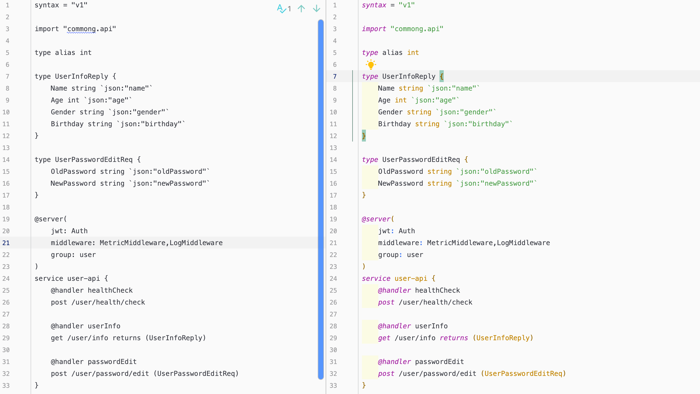
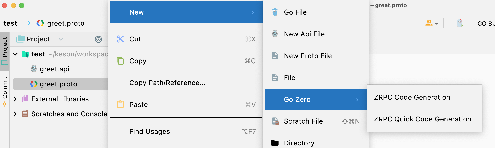
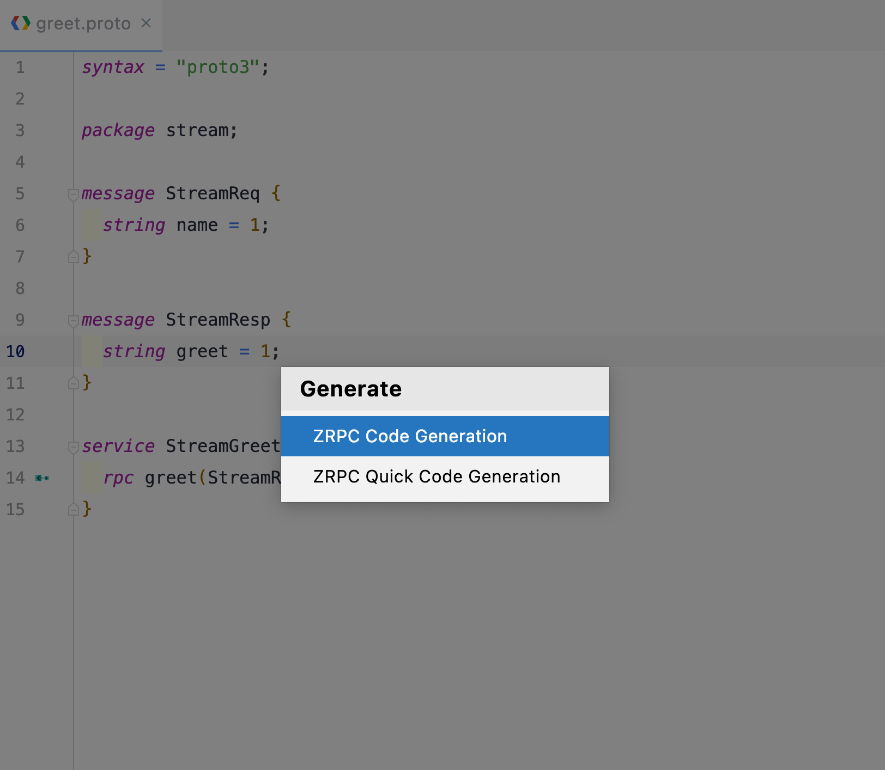
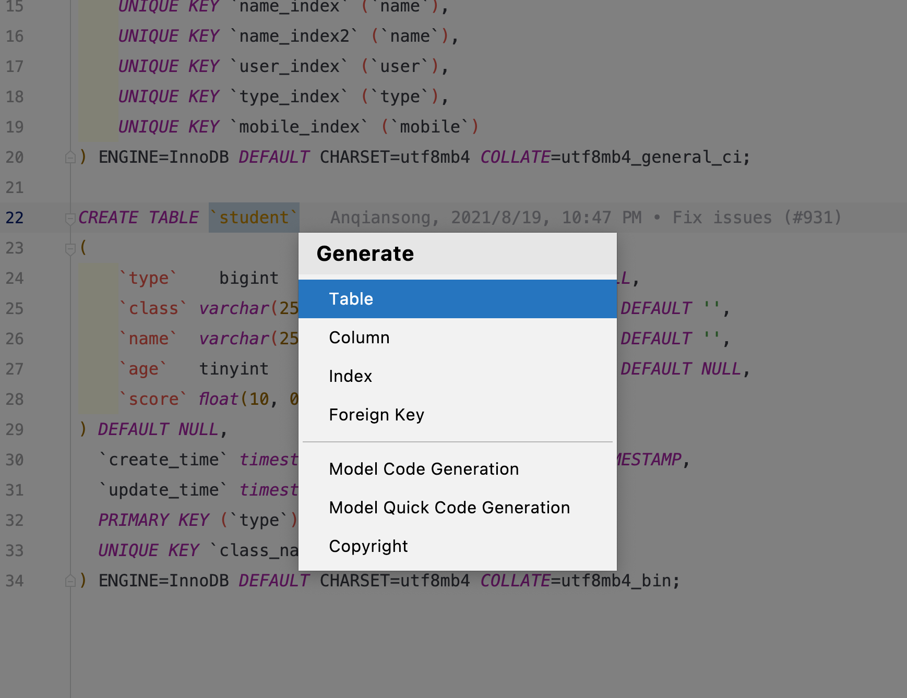
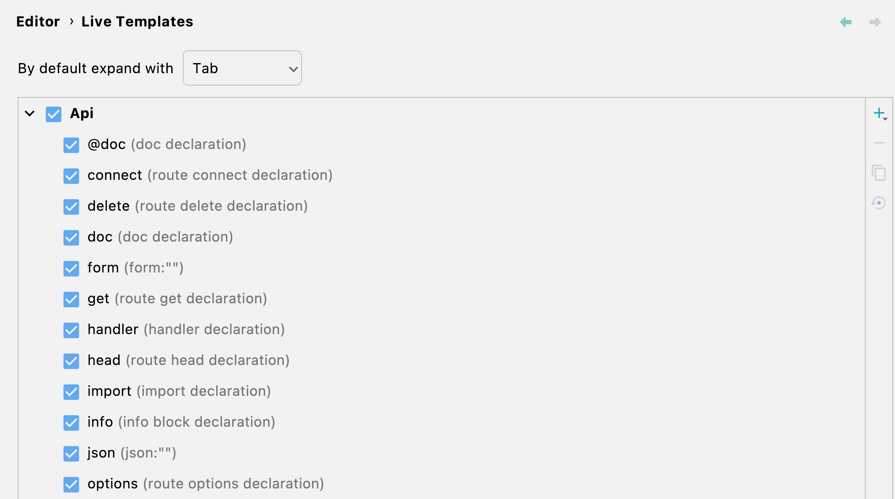

# goctl intellij  Plugin

[](https://github.com/tal-tech/go-zero)
[](https://github.com/zeromicro/goctl-intellij/blob/main/LICENSE)
[](https://github.com/zeromicro/goctl-intellij/releases)

# 介绍
一款支持go-zero api语言结构语法高亮、检测以及api、rpc、model快捷生成的插件工具。


# idea版本要求

不低于193.0(2019.3)

# 版本特性

* api语法高亮
* api语法、语义检测
* struct、route、handler重复定义检测
* type跳转到类型声明位置
* 上下文菜单中支持api、rpc、mode相关menu选项
* 代码格式化(option+command+L)
* 代码提示

# 安装方式

## 方式一
在github的release中找到最新的zip包，下载本地安装即可。（无需解压）

## 方式二
在plugin商店中，搜索`Goctl`安装即可（目前商店中已通过的版本比较低。）


# 预览


# 新建 Api file

在工程区域目标文件夹`右键 -> New -> New Api File -> Empty File/Api Template`,如图：


# 新建 Proto File
在工程区目标文件夹`右键 -> New -> New Proto File -> Empty File/Proto Template`,如图：


# 快速生成api/rpc服务
在目标文件夹`右键 -> New -> Go Zero -> Api Greet Service/Rpc Greet Service`


# Api 代码生成
## 1. api 文件右键生成


## 2. api 文件编辑区右键生成


## Api 代码生成说明
`API Code Generation` 和 `API Quick Code Generation` 的区别是：
- `API Code Generation` 中 `goctl` 的相关指令参数均使用指定值，其代码生成指令内容如下：
    ```shell
    $ goctl api go --api=${API 文件路径} --style=gozero --home="~/.goctl" --dir=${API 文件所在文件夹}
    ```
- `API Quick Code Generation` 会打开弹窗让使用者填写 `--style`，`-- dir`，`--home` 等信息
  

# zRPC 代码生成
## 1. proto 文件右键生成


## 2. proto 文件编辑区右键生成


## zRPC 代码生成说明
`ZRPC Code Generation` 和 `ZRPC Quick Code Generation` 的区别是：
- `ZRPC Code Generation` 中 `goctl` 的相关指令参数均使用指定值，其代码生成指令内容如下：
    ```shell
    $ goctl rpc protoc ${proto 文件路径} --style=gozero --home="~/.goctl" --go_out=${API 文件所在文件夹} --grpc-go_out=${API 文件所在文件夹} --zrpc_out=${API 文件所在文件夹}
    ```
- `ZRPC Quick Code Generation` 会打开弹窗让使用者填写 `--style`，`-- dir`，`--home`,`proto_path`(如果有 import 其他 proto 文件) 等信息
    - 无 import 情况
      
    - 有 import 情况，proto_path 目前只支持但文件选择，因此 **不支持 import 自不同文件夹的 proto**。
      

# Model 代码生成
## 1. sql 文件右键生成


## 2. sql 文件编辑区右键生成


## Model 代码生成说明
**Model 代码生成默认都是带缓存的。**

`Model Code Generation` 和 `Model Quick Code Generation` 的区别是：
- `Model Code Generation` 中 `goctl` 的相关指令参数均使用指定值，其代码生成指令内容如下：
    ```shell
    $ goctl model mysql ddl --src=${sql 文件路径} --dir=${sql 文件所在文件夹} --style=gozero -c --home="~/.goctl"
    ```
- `Model Quick Code Generation` 会打开弹窗让使用者填写 `--style`，`-- dir`，`--home`，`--cache` 等信息
  
-
# 错误提示


# Live Template
Live Template可以加快我们对api文件的编写，比如我们在go文件中输入`main`关键字根据tip回车后会插入一段模板代码
```golang
func main(){

}
```
或者说看到下图你会更加熟悉，曾几何时你还在这里定义过template


下面就进入今天api语法中的模板使用说明吧，我们先来看看service模板的效果


#### 预设模板及生效区域
|  模板关键字   | psiTree生效区域 |描述
|  ----  | ----  | ----  | 
| @doc  | ApiService |doc注释模板|
| doc  | ApiService |doc注释模板|
| struct  | Struct |struct声明模板|
| info  | ApiFile |info block模板|
| type  | ApiFile |type group模板|
| handler  | ApiService |handler文件名模板|
| get  | ApiService |get方法路由模板|
| head  | ApiService |head方法路由模板|
| post  | ApiService |post方法路由模板|
| put  | ApiService |put方法路由模板|
| delete  | ApiService |delete方法路由模板|
| connect  | ApiService |connect方法路由模板|
| options  | ApiService |options方法路由模板|
| trace  | ApiService |trace方法路由模板|
| service  | ApiFile |service服务block模板|
| json  | Tag|Tag literal |tag模板|
| xml  | Tag|Tag literal |tag模板|
| path  | Tag|Tag literal |tag模板|
| form  | Tag|Tag literal |tag模板|